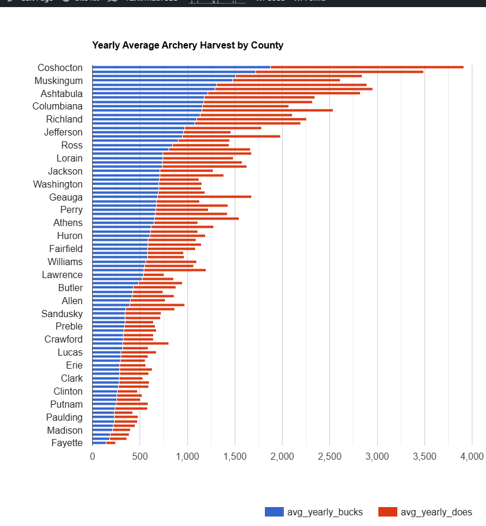
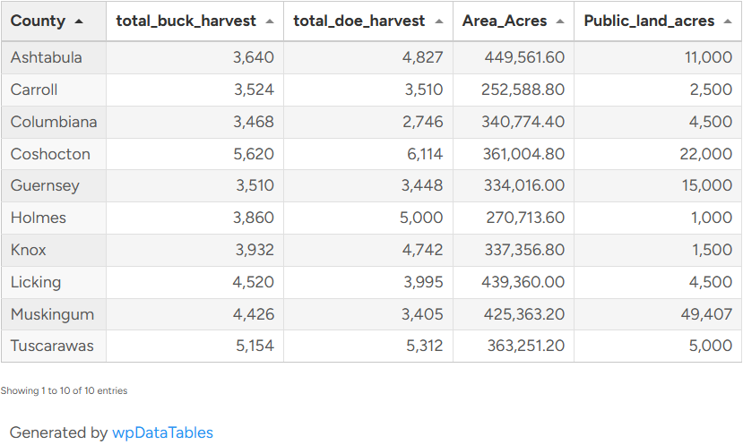
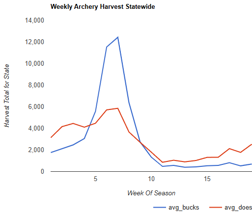

> This project is part of the Apex Hunting Solutions Data Tools initiative — focused on turning hunting data into actionable decision tools.

# Ohio Deer Harvest Dashboard

A data-driven hunting tool designed to identify the best counties and time windows to hunt deer in Ohio based on historical harvest data.

---

## 🔗 Live Dashboard

👉 https://apexhuntingsolutions.com/ohio-deer-harvest-dashboard/

---

## The Problem

Most hunters rely on anecdotal advice when deciding where and when to hunt. 
While experience matters, there is very little accessible, structured data that helps hunters make informed decisions on timing and location.

---

## The Solution

This project transforms raw harvest data into a usable decision-making tool.

The dashboard analyzes multi-year weekly harvest data to identify:

- Top-performing counties for deer harvest  
- Peak archery windows (rut timing)  
- Gun season harvest patterns and spikes  
- Weekly trends across multiple seasons  

The goal is simple:  
👉 Turn historical data into actionable hunting strategy.

---

## Key Insights

- Peak archery harvest consistently occurs in early November (Weeks 6–7)  
- Gun season harvest is heavily front-loaded during the opening days  
- Certain counties consistently outperform others across multiple seasons  
- Harvest patterns remain consistent across a 3-year sample  

---

## Data Workflow

This project required building a full data pipeline from unstructured sources:

1. Harvest data collected from ODNR weekly reports (PDF format)  
2. Converted cumulative harvest totals into true weekly values  
3. Cleaned and structured data into relational tables  
4. Stored and queried using SQL  
5. Aggregated results into usable datasets  
6. Deployed as a live dashboard via web interface  

---

## Tech Stack

- SQL (data aggregation and analysis)  
- SQLite (data storage)  
- HTML / CSS (frontend display)  
- WordPress (deployment)  

---

## Data Challenges

- ODNR data is reported as cumulative totals, requiring transformation into weekly values  
- Reporting formats changed across seasons  
- Data inconsistencies (including negative values) required cleaning and validation  
- Public land data required approximation due to lack of centralized datasets  

---

## SQL Queries

Core queries used to build the dashboard can be found here:

📁 /queries/harvest_dashboard_queries.sql

---

## Future Improvements

- Expand dataset to 5+ years for stronger trend validation  
- Add additional states and comparative analysis  
- Build interactive filtering and planning tools  
- Develop draw odds and advanced hunting strategy tools  

---

## Project Context

This project is part of the **Apex Hunting Solutions Data Tools initiative** — focused on combining real-world hunting experience with data analysis to uncover patterns most hunters overlook.

---

## Screenshots

### Yearly Archery Harvest by County

### Top Ten Archery Counties

### Weekly Archery Trends

---

## Takeaway

This project demonstrates the ability to:

- Work with messy, real-world datasets  
- Build structured data pipelines  
- Analyze trends and extract insights  
- Translate data into real-world decision-making tools  
- Deploy a finished product end-to-end  

---

👉 This is not just an analysis — it is a functional tool built for real-world use.

